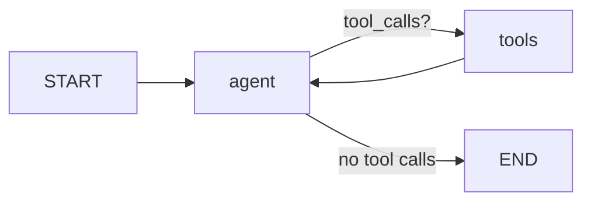

# langgraph-kb-agent ("Brain")

[](https://github.com/janvrsinsky/jv-langgraph-kb-agent/actions/workflows/tests.yml)  

> **Portfolio exhibit.** Built end to end for this portfolio on a fictional
> knowledge base. Everything runs as shown.

A ReAct-style agent over a company knowledge base, built in **LangGraph**
with **Claude** as the model. Small by design: the graph primitives are written out
in full so the control flow is readable. The knowledge base is a fictional
company (Acme Robotics), so the repo carries no real data.

## The graph



The `StateGraph` is assembled by hand, so every primitive is visible in one
file:

| LangGraph concept | Where in `agent.py` | What it does |
|---|---|---|
| `StateGraph` + `MessagesState` | `build_graph()` | State = appended message list; nodes return state deltas |
| Node | `agent_node` | Claude with tools bound via `bind_tools`; returns its message |
| `ToolNode` | `tools` node | Executes tool calls from the last AI message, emits ToolMessages |
| Conditional edge | `tools_condition` | The ReAct loop: route to tools while the model keeps calling them |
| Checkpointer | `MemorySaver` + `thread_id` | Multi-turn memory per conversation; swap for `SqliteSaver` to persist |
| Tool | `@tool search_kb` | BM25 over markdown passages (key-free retrieval for the demo) |

Retrieval here is deliberately lexical BM25, so the tests and the retrieval
itself run without any API key. That choice has a visible consequence - see
finding 4 in [LIVE-RUN.md](LIVE-RUN.md).

## Run

```bash
uv venv .venv && uv pip install -r requirements.txt --python .venv/bin/python

# offline tests: full graph loop with a scripted fake model, no key needed
.venv/bin/pytest tests/ -q

# live chat (Claude)
export ANTHROPIC_API_KEY=sk-ant-...
.venv/bin/python agent.py
# you>  How many vacation days do I get?
# you>  And how much of that can I roll over?   <- tests the thread memory

# live check: eight scripted probes against a real model, full trace + cost
.venv/bin/python live_check.py
```

Model defaults to `claude-opus-5`; override with `MODEL=claude-haiku-4-5`
for cheap experimentation. Both were run end to end - see below.

## Offline tests vs. live check

Two different questions, deliberately kept apart:

| | What it proves | Needs a key |
|---|---|---|
| `tests/` (4 tests) | the graph is **wired** right - conditional edge routes to `ToolNode`, tool results come back as `ToolMessage`, the checkpointer keeps threads apart | no |
| `live_check.py` (8 probes) | what the loop **does** with a real model deciding - parallel tool calls, query rewriting, multi-iteration retries, where the prompt rules actually hold | yes |

The offline suite is what CI runs on every push
(`.github/workflows/tests.yml`, Python 3.11-3.13) - it needs no key, so nothing in
the pipeline depends on a secret.

The findings from the live run - including the ones that contradict what the
scripted tests would lead you to expect - are written up in
**[LIVE-RUN.md](LIVE-RUN.md)**. Short version: the real model issues parallel tool
calls the fake never does, puts text *and* tool calls in the same message, rewrites
weak queries on its own behalf, and answers same-thread follow-ups straight from
checkpointed memory without searching again.

---

     
