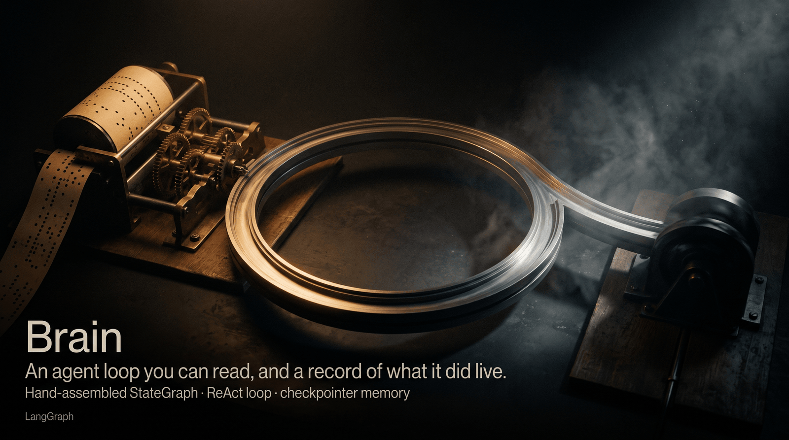
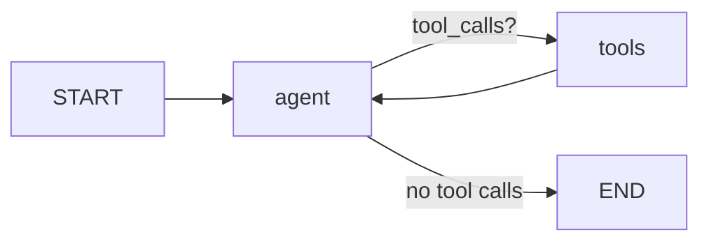

# langgraph-kb-agent ("Brain")

[](https://github.com/janvrsinsky/jv-langgraph-kb-agent/actions/workflows/tests.yml)  

> **Portfolio exhibit.** Built end to end for this portfolio on a fictional
> knowledge base. Everything runs as shown.

A ReAct-style agent over a company knowledge base, built in **LangGraph**
with **Claude** as the model, retrieving through a hand-built hybrid search.
Small by design: the graph primitives are written out in full so the control
flow is readable. The knowledge base is a fictional company (Acme Robotics),
so the repo carries no real data.

## The graph



The `StateGraph` is assembled by hand, so every primitive is visible in one
file:

| LangGraph concept | Where in `agent.py` | What it does |
|---|---|---|
| `StateGraph` + `MessagesState` | `build_graph()` | State = appended message list; nodes return state deltas |
| Node | `agent_node` | Claude with tools bound via `bind_tools`; returns its message |
| `ToolNode` | `tools` node | Executes tool calls from the last AI message, emits ToolMessages |
| Conditional edge | `tools_condition` | The ReAct loop: route to tools while the model keeps calling them |
| Checkpointer | `MemorySaver` + `thread_id` | Multi-turn memory per conversation; swap for `SqliteSaver` to persist |
| Tool | `@tool search_kb` | Hybrid retrieval over the knowledge base (see below) |

## Retrieval

The tool behind the loop does hybrid retrieval, and the whole stack is in
`retrieval/` with no dependency at all: pure standard library, so the repo runs
with no download and no API key.

| Branch | What it matches | How it fails |
|---|---|---|
| BM25 (`bm25.py`) | the words that were actually written, with a light stemmer so inflected forms still hit | a question phrased in vocabulary the corpus never uses scores exactly zero |
| Dense (`dense.py`) | surface similarity through hashed character n-grams; real embeddings behind `USE_ST=1` | it always returns a nearest neighbour, however far away it is |
| Fusion (`rrf.py`) | reciprocal rank fusion over both rankings | inherits whatever the branches got wrong |

The two branches fail in different directions, which is the reason to run both.
Reciprocal rank fusion combines their **ranks**, because BM25 scores and cosine
similarities are not on a comparable scale and their ranks are.

**Why the dense branch earns its place.** Ask *"what do I do when my phone is
stolen?"* and BM25 returns nothing at all: none of those words appear in the
knowledge base, which talks about a lost device reported to security. The dense
branch still lands on the right passage, and `test_retrieval.py` pins that case
so it stays true.

**Why there is an abstain floor.** A dense retriever has no zero, so it will
happily hand back four plausible passages for a question the corpus cannot
answer, and a model given plausible context tends to use it. The tool therefore
asks first whether any branch actually recognises the query: a lexical hit
counts outright, and the dense branch has to clear a floor of 0.28. That number
comes out of a measurement over this corpus. Unanswerable queries top out at
0.259 on the dense branch, while the lexically invisible question above reaches
0.323, and a test asserts that gap, so a change to the corpus which closes it
fails the build.

The retrieval code is the same stack that is measured and CI-gated in
[jv-podcast-rag](https://github.com/janvrsinsky/jv-podcast-rag), where the eval
tables over a larger corpus live.

## Run

```bash
uv venv .venv && uv pip install -r requirements.txt --python .venv/bin/python

# offline tests: full graph loop with a scripted fake model, no key needed
.venv/bin/pytest tests/ -q

# live chat (Claude)
export ANTHROPIC_API_KEY=sk-ant-...
.venv/bin/python agent.py
# you>  How many vacation days do I get?
# you>  And how much of that can I roll over?   <- tests the thread memory

# live check: nine scripted probes against a real model, full trace + cost
.venv/bin/python live_check.py
```

Model defaults to `claude-opus-5`; override with `MODEL=claude-haiku-4-5`
for cheap experimentation. Both were run end to end - see below.

## Offline tests vs. live check

Two different questions, deliberately kept apart:

| | What it proves | Needs a key |
|---|---|---|
| `tests/` (14 tests) | the graph is **wired** right - conditional edge routes to `ToolNode`, tool results come back as `ToolMessage`, the checkpointer keeps threads apart - and that retrieval does what the section above claims, including the measured abstain gap | no |
| `live_check.py` (9 probes) | what the loop **does** with a real model deciding - parallel tool calls, query rewriting, multi-iteration retries, where the prompt rules actually hold | yes |

The offline suite is what CI runs on every push
(`.github/workflows/tests.yml`, Python 3.11-3.13) - it needs no key, so nothing in
the pipeline depends on a secret. A second job installs pytest and nothing else,
then runs the retrieval tests, so the "standard library only" claim above has a
job behind it.

The findings from the live run - including the ones that contradict what the
scripted tests would lead you to expect - are written up in
**[LIVE-RUN.md](LIVE-RUN.md)**. Short version: the real model issues parallel tool
calls the fake never does, puts text *and* tool calls in the same message, rewrites
weak queries on its own behalf, and answers same-thread follow-ups straight from
checkpointed memory without searching again.

---

      
